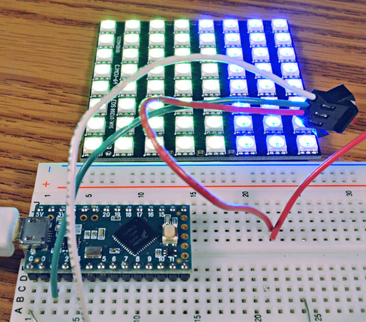

# WS2812Serial - Non-Blocking WS2812B / NeoPixel LEDs Library

Similar to [OctoWS2811](https://www.pjrc.com/teensy/td_libs_OctoWS2811.html), this library
allows you to use WS2811, WS2812, WS2812B / NeoPixel LEDs without blocking interrupts.

Non-blocking allows other libraries, especially
[Audio](https://www.pjrc.com/teensy/td_libs_Audio.html) and high speed serial communication
to function properly while the LEDs update.  Complex animation can also run faster,
because the show() function does not wait for the LEDs to update, allowing your code
more time to draw the next frame.

## Hardware Resources Used

WS2812Serial controls a single LED strip, using only 1 pin.  While any number of
LEDs may be connected, in practice 1 pin is best for small projects with less
than 600 LEDs.  OctoWS2811 offers 8 parallel outputs for large projects.

Non-blocking performance does come with a cost.  15 bytes of memory are required
per LED, rather than the usual 3 bytes with [FastLED](http://fastled.io/) or
[Adafruit NeoPixel](https://github.com/adafruit/Adafruit_NeoPixel).  One of
the [hardware serial ports](https://www.pjrc.com/teensy/td_uart.html) is also
used to transmit the data, making that port unavailable for other uses.

## Supported Pins & Serial Ports

| Port    | Teensy LC   | Teensy 3.2 | Teensy 3.5 | Teensy 3.6 |
| :------ | :---------: | :--------: | :--------: | :--------: |
| Serial1 | 1, 4, 5, 24 | 1, 5       | 1, 5, 26   | 1, 5, 26   |
| Serial2 |             | 10, 31     | 10         | 10         |
| Serial3 |             | 8, 20      | 8, 20      | 8, 20      |
| Serial4 |             |            | 32         | 32         |
| Serial5 |             |            | 33         | 33         |
| Serial6 |             |            | 48         |            |

Serial2 & Serial3 on Teensy LC are not supported, due to lack of configurable
oversampling needed to run at the high speed required.

Serial6 on Teensy 3.6 is not currently supported, due to different hardware
registers.

