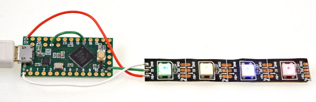

# WS2812Serial - Non-Blocking WS2812B / NeoPixel LEDs Library

Similar to [OctoWS2811](https://www.pjrc.com/teensy/td_libs_OctoWS2811.html), this library
allows you to use WS2811, WS2812, WS2812B / NeoPixel LEDs without blocking interrupts.

Non-blocking allows other libraries, especially
[Audio](https://www.pjrc.com/teensy/td_libs_Audio.html) and high speed serial communication
to function properly while the LEDs update.  Complex animation can also run faster,
because the show() function does not wait for the LEDs to update, allowing your code
more time to draw the next frame.

## Hardware Resources Used

WS2812Serial controls a single LED strip, using only 1 pin.  While any number of
LEDs may be connected, in practice 1 pin is best for small projects with less
than 600 LEDs.  OctoWS2811 offers 8 parallel outputs for large projects.

Non-blocking performance does come with a cost.  15 bytes of memory are required
per LED, rather than the usual 3 bytes with [FastLED](http://fastled.io/) or
[Adafruit NeoPixel](https://github.com/adafruit/Adafruit_NeoPixel).  One of
the [hardware serial ports](https://www.pjrc.com/teensy/td_uart.html) is also
used to transmit the data, making that port unavailable for other uses.

## Supported Pins & Serial Ports

| Port    | Teensy LC   | Teensy 3.2 | Teensy 3.5 | Teensy 3.6 | Teensy 4.0 |
| :------ | :---------: | :--------: | :--------: | :--------: | :--------: |
| Serial1 | 1, 4, 5, 24 | 1, 5       | 1, 5, 26   | 1, 5, 26   | 1          |
| Serial2 |             | 10, 31     | 10         | 10         | 8          |
| Serial3 |             | 8          | 8          | 8          | 14         |
| Serial4 |             |            | 32         | 32         | 17         |
| Serial5 |             |            | 33         | 33         | 20, 39     |
| Serial6 |             |            | 48         |            | 24         |
| Serial7 |             |            |            |            | 29         |

Serial2 & Serial3 on Teensy LC are not supported, due to lack of configurable
oversampling needed to run at the high speed required.

Serial3-Serial6 should be used only with CPU speeds 120 or 180 MHz.

Serial6 on Teensy 3.6 is not currently supported, due to different hardware
registers.

If more than one object instance is created, each must use a different
serial port, and each must have its own buffer memory.

## 5 Volt Data Signal Level

WS2812 / NeoPixel LEDs are meant to use 5 volt signals.  Most of WS2812 LEDs
made before 2014 or after 2015 can use 3.3V signals, which Teensy LC and 3.x
output.  But a buffer chip to boost the signal to 5 volts is still the best
practice.

Teensy LC has a 5V buffer chip built in, connected to pin 17.  The best way
to use this buffer is leave pin 17 unused by your program (the pin defaults
to a low power disabled state), and connect the data signals from
pin 24 (or any other supported pin) to pin 17.  Then connect the WS2812 LEDs
to the 5V signal output.

For Teensy 3.x, a separate 5V buffer chip should be used.  Unidirectional
buffer chips like
[74HCT245](https://www.fairchildsemi.com/datasheets/74/74VHCT245A.pdf) and
[74AHCT125](https://www.adafruit.com/product/1787) are best.  Do NOT use
[these mosfet transistor level shifters](https://www.sparkfun.com/products/12009).
They are far too slow for WS2812 LED data.
